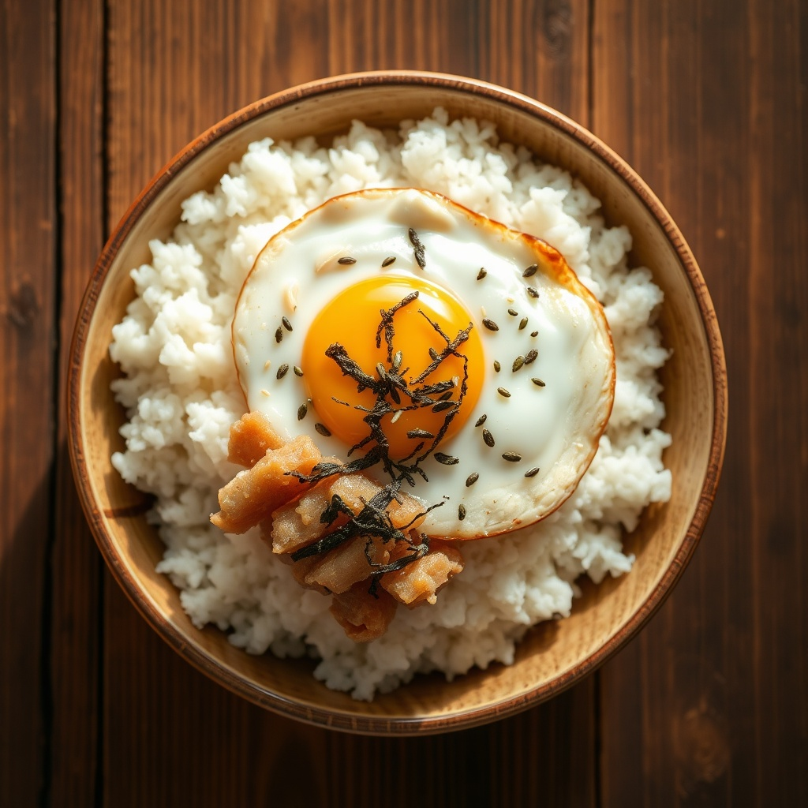

# 참치마요 덮밥

> ⏱️ 조리시간: 10분 | 🍽️ 1인분 | 난이도: ⭐ 쉬움

## 📝 재료
- 밥 — 1공기
- 참치캔(작은 것) — 1개
- 마요네즈 — 2큰술
- 양파 — 1/4개 (다진 것)
- 간장 — 1작은술
- 참기름 — 약간
- 통깨 — 약간
- 김가루 — 약간 (선택)
- 계란후라이 — 1개 (선택)

## 👨‍🍳 만드는 법
1. 참치캔의 기름을 따라내고 볼에 담습니다.
2. 양파를 잘게 다져 참치와 함께 섞습니다.
3. 마요네즈, 간장, 참기름을 넣고 골고루 버무립니다.
4. 갓 지은 밥 위에 참치마요를 얹습니다.
5. 통깨와 김가루를 뿌리고, 원하면 계란후라이를 올려 마무리합니다.

## 💡 꿀팁
- 불을 전혀 쓰지 않는 요리라 설거지가 프라이팬(계란후라이용) 하나로 끝납니다.
- 참치 대신 스팸이나 스크램블 에그로 대체해도 잘 어울립니다.
- 마요네즈 절반을 그릭요거트로 바꾸면 좀 더 담백하게 즐길 수 있습니다.
